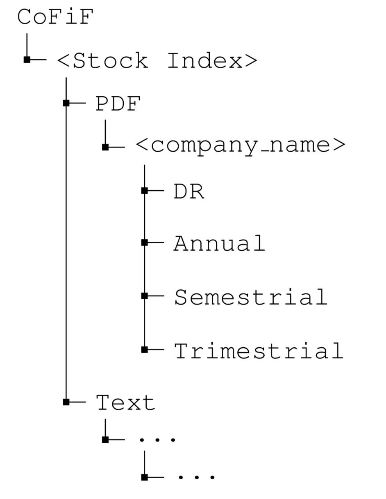

### Quick access to the data:
- [The original PDF files](https://drive.google.com/uc?id=1H0r1YJ8Jw1Z1glFe0gXoTDi9o_FwoTAG&export=download)
- [All the corresponding text files based on the structure of the PDF files](https://github.com/CoFiF/Corpus/blob/master/CoFiF/CoFiF-Text.7z)
- [All the text files, cleaned and merged in one single file](https://github.com/CoFiF/Corpus/blob/master/CoFiF/CoFiF_cleaned_text_all.7z)
- If you encounter any difficulties in cloning the data from GitHub, you can also find all the merged and cleaned text files on [Google Drive](https://drive.google.com/uc?id=1QgCfSMTIBymlzo0j2oO7P_HQTOht1O7C&export=download)
- :boom: [Two **Language models**](https://github.com/CoFiF/Corpus/tree/master/CoFiF) as described in the [paper](https://www.aclweb.org/anthology/papers/W/W19/W19-5504/) trained with the following hyper-parameters:
    - `hiddensize=2048`
    - `#layers=1`
    - `sequencelenght=250`
    - `minibatchsize=100`
    - `epochs=3`

---
# CoFiF-Corpus for Finance

CoFiF is the first corpus comprising company reports in the French language. It contains over **188 million** tokens in **2655** reports, covering four types of documents:

- Reference documents (documents de référence) published annually, usually in the months following the end of the calendar year, and contain information regarding the financial situation and perspectives of a company
- Annual report (résultats annuels) which summarises a company’s business and activities throughout the previous year
- Semestrial (résultats semestriels): similar to annual reports in content but published every 6 months
- Trimestrial reports (résultats trimestriels): similar to annual reports but published every 3 months

These documents are collected from the 60 largest French companies listed in France’s main stock indices [CAC40](https://en.wikipedia.org/wiki/CAC_40) and [CAC Next 20](https://en.wikipedia.org/wiki/CAC_Next_20). The corpus spans over 20 years, ranging from 1995 to 2018. 

## CoFiF structure
In addition to the PDF files which were collected from enterprises (all rights reserved), we provide the reports in raw text without further pre-processing. The following image illustrates CoFiF corpus directories where file and folder names may contain metadata such as date of publication (year), type of document (*DR*: reference document, *A*: annual, *S*: semestrial, *Q* or *T*: trimestrial): 

In addition to the PDF files and the raw text, we also provide a cleaned dataset `CoFiF_cleaned_all.txt` which was used for training our language model reported in the paper. Find the language models and the merged cleaned text files at [https://github.com/CoFiF/Corpus/tree/master/CoFiF](https://github.com/CoFiF/Corpus/tree/master/CoFiF).

For further information on how to use the language model, please check out [https://github.com/flairNLP/flair/tree/master/resources/docs](https://github.com/flairNLP/flair/tree/master/resources/docs).

## Reference 
If you're using CoFiF in your researches, please don't forget to cite [this paper](https://www.aclweb.org/anthology/papers/W/W19/W19-5504/):

~~~
@inproceedings{daudert-ahmadi-2019-cofif,
    title = "{C}o{F}i{F}: A Corpus of Financial Reports in {F}rench Language",
    author = "Daudert, Tobias  and Ahmadi, Sina",
    booktitle = "Proceedings of the First Workshop on Financial Technology and Natural Language Processing",
    month = "12 " # aug,
    year = "2019",
    address = "Macao, China",
    url = "https://www.aclweb.org/anthology/W19-5504",
    pages = "21--26",
}
~~~
## License 
This corpus is openly available for non-commercial use under the [Attribution-NonCommercial-ShareAlike 4.0 International](https://creativecommons.org/licenses/by-nc-sa/4.0/).

## Contact 
If you have any questions or suggestions, you can contact Sina Ahmadi (sina.ahmadi@insight-centre.org) and Tobias Daudert (tobias.daudert@insight-centre.org).

